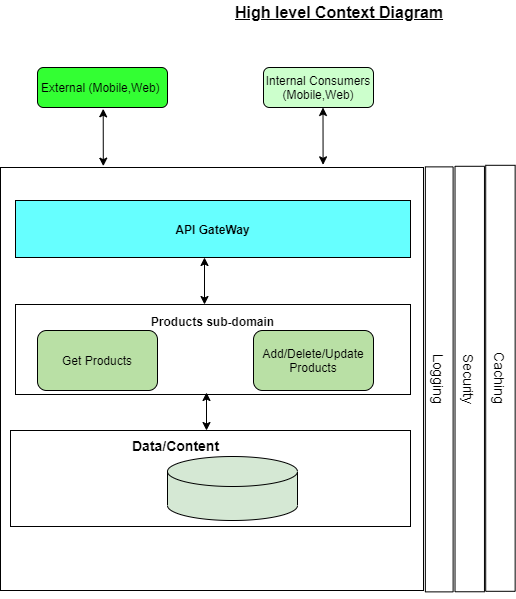
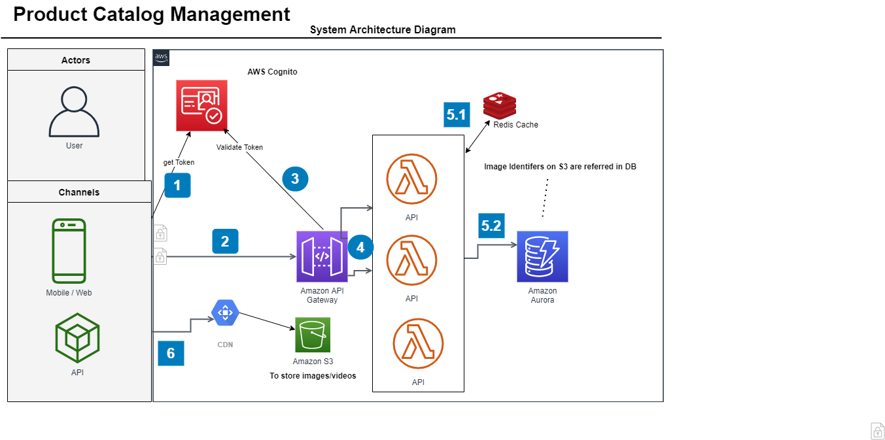
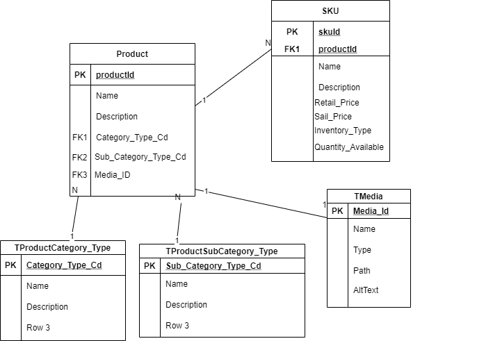

This is a Sample Springboot project exposing a Rest API to Get List of Products by an Optional Criteria attribute.
## 1.High Level Context

## 2a.Approach-1 : System Arch Diagram

## 2b.Approach-2 : System Arch Diagram

## 3:Sequence Diagram

## 4:DataModel:
  

## Project Execution Process :

  I would create  Jira Tickets/Rally User stories under the Product Catalog Mmgt Feature as below : 
  
 But at a high level need to outline the activities and track the activities :  Design/Setup/Build/Test/Release. 

 In this context, it makes sense to split by individual business functions (i.e API's which support different business capabilities). 
  ## Feature-F123 : Product Catalog Management 
   # US-1 (GET Products) 
   # US-2 (ADD Product) 
   # US-3 (UPDATE Product) 
   # US-4 (DELETE Product) 
    //Below are the Tech enabler stories which are needed before functional stories can be delivered. 
   # US-00 (Define API Specs) 
   # US-01(DataModel Design) 
   # US-02 (Infrasetup) 
   # US-03 (DB setup (Schema/DDL)) 
    
   Also we can have 
   # US-NFR (eg: Performance,Security)   - This can be baked into the a task in functional user-stories also instead of standalone user story. 
 
 
  For each user story , we can have the below **Tasks** under the User Stories based on the context/need. 
   # 1) Analyze 
   # 2) Build 
   # 3) Test
   # 4) Review 
   # 5) Deploy 
   # 6) Release
    

